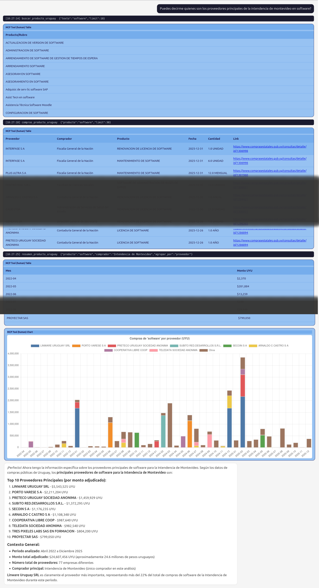

# Uruguay

**Repo:** [okfn/mcp-datos-uruguay-ben](https://github.com/okfn/mcp-datos-uruguay-ben)
&middot; **Portal:** [catalogodatos.gub.uy](https://catalogodatos.gub.uy/)
&middot; **Language:** Spanish

MCP tools over Uruguay's *Balance Energetico Nacional* (BEN, the
national energy balance), published by the Ministry of Industry, Energy
and Mining (MIEM) on the national open data portal.

## Highlights

The plugin exposes tools over the electricity matrix, installed
capacity, the grid emission factor, final consumption, primary supply,
oil and gas imports, electricity exchange, and CO2 emissions by sector,
plus a [BEN glossary](../lessons/glossary.md) of official definitions.

## Focused by design

This repo replaced the older, broader `mcp-datos-uruguay`, which tried
to cover the whole portal and grew too general. Scoping the plugin to a
single, well-understood domain (energy) is a deliberate choice: see
[why we scope plugins narrowly](../lessons/scope.md).

## Installing it

It is a pip-installable Python package. Install it into the MCP server's
environment and restart the server; there is no `tool_sources.yaml`
entry to add. Descriptions, parameters and sample questions are written
in Spanish, matching the audience.

## From the field

This catalog powered a public pilot over Uruguay's energy data in July
2026. Everything we learned running it, the strengths, the failure
modes, and the changes we shipped, is written up in [lessons from the
pilot](../lessons/index.md).
