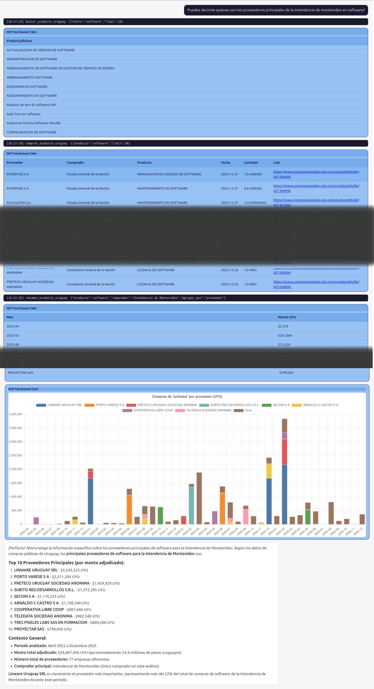

# A implementação do Uruguai

**Repo:** [okfn/mcp-datos-uruguay-ben](https://github.com/okfn/mcp-datos-uruguay-ben)
&middot; **Portal:** [catalogodatos.gub.uy](https://catalogodatos.gub.uy/)
&middot; **Idioma:** espanhol

Ferramentas MCP sobre o *Balance Energetico Nacional* (BEN, o balanço
energético nacional) do Uruguai, publicado pelo Ministério da
Indústria, Energia e Mineração (MIEM) no portal nacional de dados
abertos.

## Destaques

O plugin expõe ferramentas sobre a matriz elétrica, a capacidade
instalada, o fator de emissão da rede, o consumo final, a oferta
primária, as importações de petróleo e gás, o intercâmbio de
eletricidade e as emissões de CO2 por setor, além de um
[glossário do BEN](../plugins/glossaries.md) com definições oficiais.

## Focado de propósito

Este repo substituiu o antigo `mcp-datos-uruguay`, mais amplo, que
tentava cobrir o portal inteiro e ficou genérico demais. Restringir o
plugin a um único domínio bem compreendido (energia) é uma escolha
deliberada: veja [por que restringimos o escopo dos
plugins](../dev/design-pattern.md).

## Instalação

É um pacote Python instalável com pip. Instale-o no ambiente do
servidor MCP e reinicie o servidor. As descrições, os parâmetros e as
perguntas de exemplo estão escritos em espanhol, de acordo com o
público.

## Direto do campo

Este catálogo alimentou um piloto público sobre os dados de energia do
Uruguai em julho de 2026. Tudo o que aprendemos ao operá-lo, os pontos
fortes, os modos de falha e as mudanças que publicamos, está registrado
no *Field Guide to Connecting AI to Public Information*.
