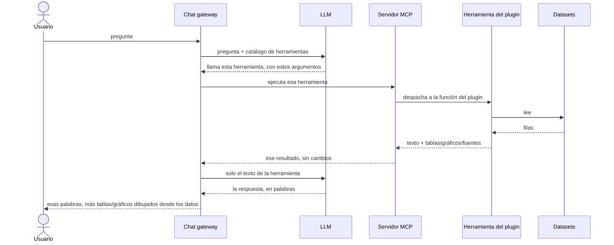

# Arquitectura del sistema

La plataforma consta de tres componentes centrales coordinados por un
orquestador central:

- **Chat gateway**: el iniciador central que maneja la entrada del
  usuario y orquesta las llamadas entre el LLM y el servidor MCP.
- **LLM**: genera prosa en lenguaje natural y decide qué herramientas
  invocar según los prompts del usuario.
- **Servidor MCP y plugins**: recibe las llamadas a herramientas desde
  el gateway y las despacha al código del plugin específico del dominio
  para leer los datos crudos.

El LLM y el servidor MCP nunca hablan entre sí directamente; el gateway
actúa como único intermediario e iniciador. El servidor MCP no puede
interrumpir: solo habla cuando se le habla.

## Flujo de ejecución

Antes de procesar preguntas de usuarios, el gateway solicita el
catálogo de herramientas (`tools/list`) al servidor MCP y lo guarda en
caché. Este paso no requiere ninguna IA, así que para cuando al modelo
se le pregunta algo, el catálogo del que elige ya está fijo. Ejecutar
una herramienta es `tools/call`.

Cuando un usuario envía una pregunta, el ciclo de ejecución procede
así:

1. **Pedido de herramienta.** El gateway envía el prompt del usuario y
   el catálogo de herramientas en caché al LLM. El LLM selecciona una
   herramienta apropiada y devuelve los argumentos requeridos.
2. **Obtención de datos.** El gateway llama a la herramienta a través
   del servidor MCP (`tools/call`). El plugin ejecuta tu código para
   obtener los registros crudos.
3. **División de datos.** El plugin divide su salida en dos partes:
   resúmenes en texto plano enviados de vuelta al LLM a través del
   gateway, y datos estructurados (tablas, gráficos y enlaces a
   fuentes) enviados directamente a la interfaz del gateway.
4. **Respuesta final.** El LLM recibe los datos en texto plano y genera
   una respuesta en lenguaje natural. El gateway combina esta prosa con
   las tablas y los gráficos estructurados para mostrar la respuesta
   final al usuario.

El medio del diagrama puede repetirse: si el modelo quiere una segunda
herramienta, pide de nuevo y el ciclo corre una vez más antes de la
respuesta final.

## Reglas técnicas clave

- **Los datos estructurados no pasan por el LLM.** Las tablas y los
  gráficos fluyen directamente del plugin a la interfaz de usuario.
  Nunca pasan por el contexto del modelo, lo que reduce el consumo de
  tokens y evita que el LLM muestre mal elementos de la interfaz.
- **Núcleo genérico, plugins específicos del dominio.** El gateway, el
  LLM y el servidor MCP son agnósticos al dataset. Todo el conocimiento
  del dominio y la lógica de obtención de datos viven enteramente
  dentro del plugin.
- **Contrato estricto de fuentes.** Las herramientas deben incluir un
  payload `structuredContent` que declare la fuente exacta de los
  datos. El servidor MCP hace cumplir este contrato al arranque y
  rechaza cualquier herramienta que no declare su fuente.
- **Mensajes directos (mensaje `force`).** Un plugin puede enviar un
  mensaje directamente a la pantalla del usuario, por encima del
  modelo: texto que se muestra al usuario como un mensaje propio.

## Dónde se ubica el plugin

La **herramienta del plugin** es la única parte de esta imagen que sabe
algo sobre un dataset específico. Todo lo que está arriba es genérico:
el gateway, el LLM y el servidor MCP funcionarían igual sobre enmiendas
parlamentarias o sobre un balance energético. Todo lo que está abajo es
un archivo.

El servidor MCP no lee datos. Recibe una llamada, despacha a la función
del plugin registrada bajo ese nombre y pasa el resultado de vuelta
**sin cambios**. Así que los números que ve un usuario fueron
calculados por código del repo del plugin de un país, por gente que
conoce esos datos, que es exactamente por qué los plugins están
[acotados a un dominio que alguien entiende](design-pattern.md).

## Recursos de datos abiertos

Además de herramientas, el servidor expone **recursos MCP** siguiendo
el estándar, más una herramienta que le permite al usuario descubrir
qué recursos están disponibles y consumirlos. Esto invita a los
usuarios a seguir analizando los datos fuera del chat: alguien puede
seguir un enlace desde una respuesta hasta el recurso subyacente y
continuar por su cuenta, con una planilla de cálculo, un notebook o lo
que prefiera.

También refuerza la idea de trazabilidad: los datos no están atrapados
dentro del asistente, apuntan de vuelta al portal abierto del que
vinieron.

## Transportes

El servidor MCP habla dos transportes:

- **stdio**: para uso local y depuración, por ejemplo conectarlo a
  Claude Desktop.
- **HTTP**: para despliegues en producción, donde el gateway (o
  cualquier cliente) se conecta por la red.

Dos decisiones de diseño deliberadas completan la arquitectura: las
[restricciones arquitectónicas](constraints.md) (gateway sin estado,
presentación estructurada) y el [patrón de diseño de plugins
modulares](design-pattern.md).
