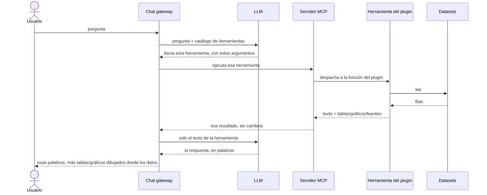

# Arquitectura

Tres partes móviles hacen funcionar la plataforma, el chat gateway, el LLM y el
servidor MCP con sus herramientas de plugin, y un contrato las une.

El **gateway es el único iniciador**: llama tanto al LLM como al servidor
MCP y espera cada respuesta. El LLM y el servidor MCP nunca hablan entre
sí, y el servidor MCP no puede interrumpir: solo habla cuando se le
habla.

Esa es toda la imagen en tiempo de ejecución, y el tiempo corre hacia
abajo. El LLM le responde al gateway **dos veces, en dos momentos
distintos**, y las dos respuestas no son la misma clase de cosa:

- **La primera respuesta nombra una herramienta.** El modelo todavía no
  vio ningún dato. Está mirando el catálogo de herramientas y eligiendo
  una, así que esta respuesta es un pedido, no una respuesta.
- **La última respuesta es la respuesta.** A esta altura la herramienta
  ya corrió y el gateway le entregó al modelo el texto de la
  herramienta, así que el modelo está escribiendo prosa sobre datos que
  realmente recibió.

El medio del diagrama puede repetirse: si el modelo quiere una segunda
herramienta, pide de nuevo y el ciclo corre una vez más antes de la
respuesta final.

Fíjate por dónde viajan los datos estructurados: al LLM se le entrega
solo el texto de la herramienta, mientras que las tablas y los gráficos
pasan de largo, directo a la pantalla del usuario, [sin pasar nunca por
la IA](../overview/idea.md).

## Dónde se ubica el plugin

La **herramienta del plugin** es la única parte de esta imagen que sabe
algo sobre un dataset específico. Todo lo que está arriba es genérico:
el gateway, el LLM y el servidor MCP funcionarían igual sobre enmiendas
parlamentarias o sobre un balance energético. Todo lo que está abajo es
un archivo.

El servidor MCP no lee datos. Recibe una llamada, despacha a la función
del plugin registrada bajo ese nombre y pasa el resultado de vuelta
**sin cambios**. Así que los números que ve un usuario fueron calculados
por código del repo del plugin de un país, por gente que conoce esos
datos, que es exactamente por qué los plugins están [acotados a un
dominio que alguien entiende](../lessons/scope.md).

## Lo que el diagrama deja afuera

**El catálogo de herramientas llega primero.** Antes de todo esto, el
gateway le pide al servidor MCP su lista de herramientas (`tools/list`)
y la guarda en caché. Esa llamada es iniciativa propia del gateway y
ocurre sin ninguna IA involucrada, así que para cuando al modelo se le
pregunta algo, el catálogo del que elige ya está fijo. Ejecutar una
herramienta es `tools/call`.

**Una herramienta puede dirigirse al usuario directamente.** Además de
tablas y gráficos, una herramienta puede devolver un mensaje `force`:
texto que se muestra al usuario como un mensaje propio, que nunca se
agrega a la conversación que lee el LLM. La herramienta le habla al
humano por encima del modelo, por diseño.

## El contrato

Cada herramienta devuelve un texto para el LLM **y** un payload
`structuredContent` para la interfaz, y ese payload debe declarar de
dónde vinieron los datos.

Las fuentes no son una convención. Una herramienta que no declara el
contrato portador de fuentes es rechazada al arranque y nunca se vuelve
invocable, lo cual es más estricto de lo que exige el estándar MCP. Mira
[resultados de las herramientas](../plugins/tool-results.md) para la
forma completa y cómo se hace cumplir.

## Transportes

El servidor MCP habla dos transportes:

- **stdio**: para uso local, por ejemplo conectarlo a Claude Desktop.
- **HTTP**: para despliegues reales, donde el gateway (o cualquier
  cliente) se conecta por la red.
