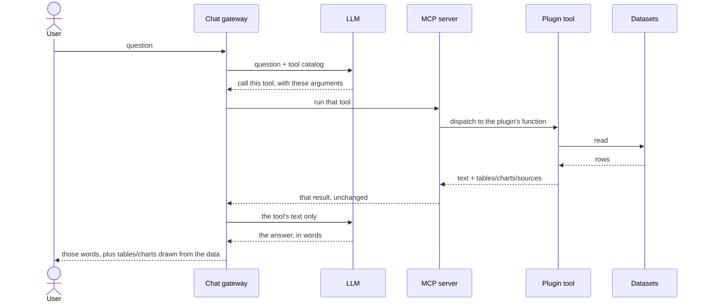

# Architecture

Three moving parts, one contract between them.

The **gateway is the only initiator**: it calls both the LLM and the MCP
server and waits for each reply. The LLM and the MCP server never talk to
each other, and the MCP server cannot interrupt: it only ever speaks when
spoken to.

That is the whole runtime picture, and time runs downward. The LLM
answers the gateway **twice, at two different moments**, and the two
replies are not the same kind of thing:

- **The first reply names a tool.** The model has not seen any data yet.
  It is looking at the tool catalog and picking one, so this reply is a
  request, not an answer.
- **The last reply is the answer.** By now the tool has run and the
  gateway has handed the model the tool's text, so the model is writing
  prose about data it has actually been given.

The middle of the diagram can repeat: if the model wants a second tool,
it asks again and the cycle runs once more before the final reply.

Note the last two arrows: the tool's **text** goes back to the LLM,
while the tables and charts carry on past it to the user's screen,
[never passing through the AI](../overview/idea.md).

## Where the plugin sits

The **plugin tool** is the only part of this picture that knows anything
about a specific dataset. Everything above it is generic: the gateway,
the LLM and the MCP server would work identically over parliamentary
amendments or over an energy balance. Everything below it is a file.

The MCP server does not read data. It receives a call, dispatches to the
plugin function registered under that name, and passes the result back
out **unchanged**. So the numbers a user sees were computed by code from
a country's plugin repo, by people who know that data, which is exactly
why plugins are [scoped to a domain someone
understands](../lessons/scope.md).

## What the diagram leaves out

**The tool catalog arrives first.** Before any of this, the gateway asks
the MCP server for its list of tools (`tools/list`) and caches it. That
call is the gateway's own initiative and happens with no AI involved, so
by the time the model is asked anything, the catalog it chooses from is
already fixed. Running a tool is `tools/call`.

**A tool can address the user directly.** Besides tables and charts, a
tool can return a `force` message: text shown to the user as its own
message, which is never added to the conversation the LLM reads. The
tool is talking to the human over the model's head, by design.

## The contract

Every tool returns a text for the LLM **and** a `structuredContent`
payload for the interface, and that payload must declare where the data
came from.

The sources are not a convention. A tool that does not declare the
source-carrying contract is refused at startup and never becomes
callable, which is stricter than the MCP standard requires. See [tool
results](../plugins/tool-results.md) for the full shape and how it is
enforced.

## Transports

The MCP server speaks two transports:

- **stdio**: for local use, e.g. plugging it into Claude Desktop.
- **HTTP**: for real deployments, where the gateway (or any client)
  connects over the network.
