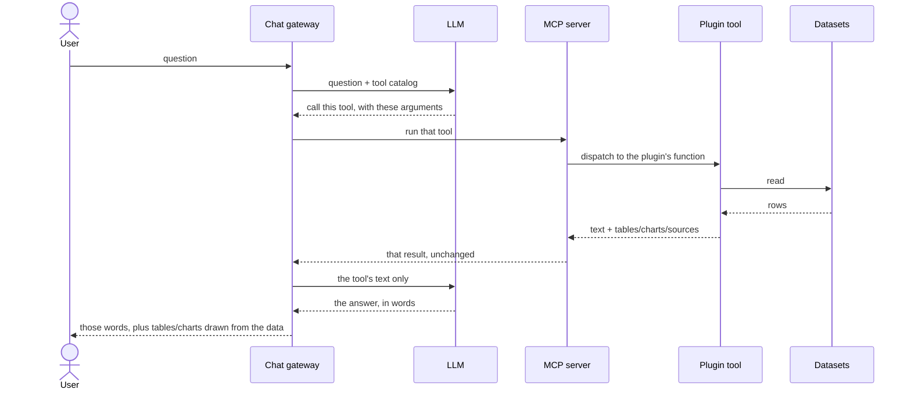

# System architecture

The platform consists of three core components coordinated by a
central orchestrator:

- **Chat gateway**: the central initiator that handles user input and
  orchestrates calls between the LLM and the MCP server.
- **LLM**: generates natural language prose and decides which tools to
  invoke based on user prompts.
- **MCP server and plugins**: receives tool calls from the gateway and
  dispatches them to domain-specific plugin code to read raw data.

The LLM and the MCP server never talk to each other directly; the
gateway acts as the sole intermediary and initiator. The MCP server
cannot interrupt: it only ever speaks when spoken to.

## Execution flow

Before processing user questions, the gateway requests the tool catalog
(`tools/list`) from the MCP server and caches it. This step requires no
AI, so by the time the model is asked anything, the catalog it chooses
from is already fixed. Running a tool is `tools/call`.

When a user submits a question, the runtime cycle proceeds as follows:

1. **Tool request.** The gateway sends the user prompt and the cached
   tool catalog to the LLM. The LLM selects an appropriate tool and
   returns the required arguments.
2. **Data retrieval.** The gateway calls the tool via the MCP server
   (`tools/call`). The plugin executes Python code or reads YAML data
   to fetch raw records.
3. **Data division.** The plugin splits its output into two parts:
   plain text summaries sent back to the LLM via the gateway, and
   structured data (tables, charts and source links) sent directly to
   the gateway UI.
4. **Final response.** The LLM receives the plain text data and
   generates a natural language answer. The gateway combines this
   prose with the structured tables and charts to render the final
   response to the user.

```mermaid
sequenceDiagram
    actor User
    participant Gateway as Chat gateway
    participant LLM
    participant MCP as MCP server
    participant Tool as Plugin tool
    participant Data as Datasets

    User->>Gateway: question
    Gateway->>LLM: question + tool catalog
    LLM-->>Gateway: call this tool, with these arguments
    Gateway->>MCP: run that tool
    MCP->>Tool: dispatch to the plugin's function
    Tool->>Data: read
    Data-->>Tool: rows
    Tool-->>MCP: text + tables/charts/sources
    MCP-->>Gateway: that result, unchanged
    Gateway->>LLM: the tool's text only
    LLM-->>Gateway: the answer, in words
    Gateway-->>User: those words, plus tables/charts drawn from the data
```

Time runs downward. The LLM answers the gateway **twice, at two
different moments**, and the two replies are not the same kind of
thing:

- **The first reply names a tool.** The model has not seen any data
  yet. It is looking at the tool catalog and picking one, so this reply
  is a request, not an answer.
- **The last reply is the answer.** By now the tool has run and the
  gateway has handed the model the tool's text, so the model is writing
  prose about data it has actually been given.

The middle of the diagram can repeat: if the model wants a second tool,
it asks again and the cycle runs once more before the final reply.

## Key technical rules

- **Structured data bypasses the LLM.** Tables and charts flow directly
  from the plugin to the user interface. They never pass through the
  model context, which reduces token overhead and prevents the LLM from
  misrendering UI elements.
- **Generic core, domain-specific plugins.** The gateway, the LLM and
  the MCP server are dataset-agnostic. All domain knowledge and data
  retrieval logic live entirely inside the plugin.
- **Strict source contract.** Tools must include a `structuredContent`
  payload declaring the exact data source. The MCP server enforces this
  contract at startup and rejects any tool that fails to declare its
  source. See [the contract](#the-contract) below.
- **Direct messaging (`force` message).** A plugin can send a message
  directly to the user's screen, over the model's head: text shown to
  the user as its own message, never added to the conversation the LLM
  reads. This lets tools display strict system limits or warnings
  without LLM interference.

## Where the plugin sits

The **plugin tool** is the only part of this picture that knows
anything about a specific dataset. Everything above it is generic: the
gateway, the LLM and the MCP server would work identically over
parliamentary amendments or over an energy balance. Everything below it
is a file.

The MCP server does not read data. It receives a call, dispatches to
the plugin function registered under that name, and passes the result
back out **unchanged**. So the numbers a user sees were computed by
code from a country's plugin repo, by people who know that data, which
is exactly why plugins are [scoped to a domain someone
understands](design-pattern.md).

## The contract

Every tool returns a text for the LLM **and** a `structuredContent`
payload for the interface, and that payload must declare where the data
came from.

The sources are not a convention. A tool that does not declare the
source-carrying contract is refused at startup and never becomes
callable, which is stricter than the MCP standard requires. See [tool
results](../plugins/tool-results.md) for the full shape and how it is
enforced.

## Transports

The MCP server speaks two transports:

- **stdio**: for local use and debugging, e.g. plugging it into Claude
  Desktop.
- **HTTP**: for production deployment, where the gateway (or any
  client) connects over the network.

Two deliberate design decisions round out the architecture: the
[architectural constraints](constraints.md) (stateless gateway,
structured presentation) and the [modular plugins design
pattern](design-pattern.md).
