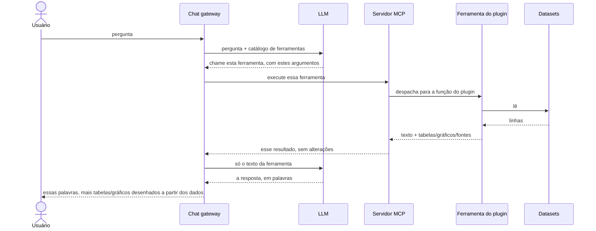

# Arquitetura

Três partes móveis fazem a plataforma funcionar, o chat gateway, o LLM e o
servidor MCP com suas ferramentas de plugin, e um contrato as amarra.

O **gateway é o único iniciador**: ele chama tanto o LLM quanto o
servidor MCP e espera cada resposta. O LLM e o servidor MCP nunca falam
entre si, e o servidor MCP não pode interromper: ele só fala quando
alguém fala com ele.

Essa é toda a imagem em tempo de execução, e o tempo corre para baixo.
O LLM responde ao gateway **duas vezes, em dois momentos diferentes**, e
as duas respostas não são o mesmo tipo de coisa:

- **A primeira resposta nomeia uma ferramenta.** O modelo ainda não viu
  nenhum dado. Ele está olhando o catálogo de ferramentas e escolhendo
  uma, então essa resposta é um pedido, não uma resposta.
- **A última resposta é a resposta.** A essa altura a ferramenta já
  rodou e o gateway entregou ao modelo o texto da ferramenta, então o
  modelo está escrevendo prosa sobre dados que ele realmente recebeu.

O meio do diagrama pode se repetir: se o modelo quiser uma segunda
ferramenta, ele pede de novo e o ciclo roda mais uma vez antes da
resposta final.

Repare por onde os dados estruturados viajam: o LLM recebe apenas o
texto da ferramenta, enquanto as tabelas e os gráficos passam direto,
rumo à tela do usuário, [sem nunca passar pela IA](../overview/idea.md).

## Onde o plugin se encaixa

A **ferramenta do plugin** é a única parte dessa imagem que sabe alguma
coisa sobre um dataset específico. Tudo acima dela é genérico: o
gateway, o LLM e o servidor MCP funcionariam de forma idêntica sobre
emendas parlamentares ou sobre um balanço energético. Tudo abaixo dela
é um arquivo.

O servidor MCP não lê dados. Ele recebe uma chamada, despacha para a
função do plugin registrada sob aquele nome e passa o resultado de volta
**sem alterações**. Então os números que um usuário vê foram calculados
por código do repo do plugin de um país, por pessoas que conhecem
aqueles dados, que é exatamente por que os plugins são [restritos a um
domínio que alguém entende](../lessons/scope.md).

## O que o diagrama deixa de fora

**O catálogo de ferramentas chega primeiro.** Antes de tudo isso, o
gateway pede ao servidor MCP a sua lista de ferramentas (`tools/list`) e
a guarda em cache. Essa chamada é iniciativa do próprio gateway e
acontece sem nenhuma IA envolvida, então quando o modelo é consultado, o
catálogo do qual ele escolhe já está fixo. Executar uma ferramenta é
`tools/call`.

**Uma ferramenta pode se dirigir ao usuário diretamente.** Além de
tabelas e gráficos, uma ferramenta pode retornar uma mensagem `force`:
texto mostrado ao usuário como uma mensagem própria, que nunca é
adicionada à conversa que o LLM lê. A ferramenta está falando com o
humano por cima do modelo, de propósito.

## O contrato

Toda ferramenta retorna um texto para o LLM **e** um payload
`structuredContent` para a interface, e esse payload deve declarar de
onde os dados vieram.

As fontes não são uma convenção. Uma ferramenta que não declara o
contrato portador de fontes é recusada na inicialização e nunca se torna
chamável, o que é mais rigoroso do que o padrão MCP exige. Veja
[resultados das ferramentas](../plugins/tool-results.md) para a forma
completa e como isso é aplicado.

## Transportes

O servidor MCP fala dois transportes:

- **stdio**: para uso local, por exemplo conectá-lo ao Claude Desktop.
- **HTTP**: para implantações reais, onde o gateway (ou qualquer
  cliente) se conecta pela rede.
