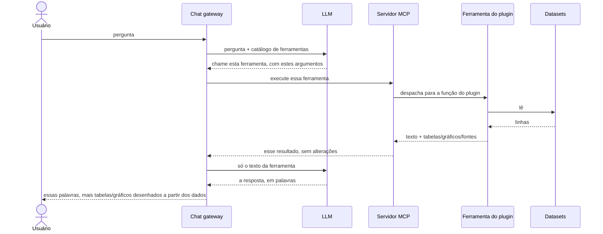

# Arquitetura do sistema

A plataforma consiste em três componentes centrais coordenados por um
orquestrador central:

- **Chat gateway**: o iniciador central, que recebe a entrada do
  usuário e orquestra as chamadas entre o LLM e o servidor MCP.
- **LLM**: gera prosa em linguagem natural e decide quais ferramentas
  invocar com base nos prompts do usuário.
- **Servidor MCP e plugins**: recebe as chamadas de ferramentas do
  gateway e as despacha para o código de plugin específico de domínio,
  que lê os dados brutos.

O LLM e o servidor MCP nunca falam entre si diretamente; o gateway
atua como único intermediário e iniciador. O servidor MCP não pode
interromper: ele só fala quando alguém fala com ele.

## Fluxo de execução

Antes de processar as perguntas do usuário, o gateway pede o catálogo
de ferramentas (`tools/list`) ao servidor MCP e o guarda em cache.
Esse passo não exige nenhuma IA, então quando o modelo é consultado, o
catálogo do qual ele escolhe já está fixo. Executar uma ferramenta é
`tools/call`.

Quando um usuário envia uma pergunta, o ciclo de execução procede
assim:

1. **Pedido de ferramenta.** O gateway envia o prompt do usuário e o
   catálogo de ferramentas em cache ao LLM. O LLM seleciona uma
   ferramenta apropriada e retorna os argumentos necessários.
2. **Recuperação dos dados.** O gateway chama a ferramenta via
   servidor MCP (`tools/call`). O plugin executa o seu código para
   buscar os registros brutos.
3. **Divisão dos dados.** O plugin divide sua saída em duas partes:
   resumos em texto simples enviados de volta ao LLM via gateway, e
   dados estruturados (tabelas, gráficos e links para as fontes)
   enviados diretamente à interface do gateway.
4. **Resposta final.** O LLM recebe os dados em texto simples e gera
   uma resposta em linguagem natural. O gateway combina essa prosa com
   as tabelas e os gráficos estruturados para renderizar a resposta
   final ao usuário.

O meio do diagrama pode se repetir: se o modelo quiser uma segunda
ferramenta, ele pede de novo e o ciclo roda mais uma vez antes da
resposta final.

## Regras técnicas centrais

- **Os dados estruturados não passam pelo LLM.** Tabelas e gráficos
  fluem diretamente do plugin para a interface do usuário. Eles nunca
  passam pelo contexto do modelo, o que reduz o custo em tokens e
  impede que o LLM renderize mal elementos de interface.
- **Núcleo genérico, plugins específicos de domínio.** O gateway, o
  LLM e o servidor MCP são agnósticos quanto ao dataset. Todo o
  conhecimento de domínio e a lógica de recuperação de dados vivem
  inteiramente dentro do plugin.
- **Contrato de fontes rigoroso.** As ferramentas devem incluir um
  payload `structuredContent` declarando a fonte exata dos dados. O
  servidor MCP garante esse contrato na inicialização e recusa
  qualquer ferramenta que não declare sua fonte.
- **Mensagem direta (mensagem `force`).** Um plugin pode enviar uma
  mensagem diretamente para a tela do usuário, por cima do modelo:
  texto mostrado ao usuário como uma mensagem própria.

## Onde o plugin se encaixa

A **ferramenta do plugin** é a única parte dessa imagem que sabe
alguma coisa sobre um dataset específico. Tudo acima dela é genérico:
o gateway, o LLM e o servidor MCP funcionariam de forma idêntica sobre
emendas parlamentares ou sobre um balanço energético. Tudo abaixo dela
é um arquivo.

O servidor MCP não lê dados. Ele recebe uma chamada, despacha para a
função do plugin registrada sob aquele nome e passa o resultado de
volta **sem alterações**. Então os números que um usuário vê foram
calculados por código do repo do plugin de um país, por pessoas que
conhecem aqueles dados, que é exatamente por que os plugins são
[restritos a um domínio que alguém entende](design-pattern.md).

## Recursos de dados abertos

Além de ferramentas, o servidor expõe **recursos MCP** seguindo o
padrão, mais uma ferramenta que permite ao usuário descobrir quais
recursos estão disponíveis e consumi-los. Isso convida os usuários a
continuar analisando os dados fora do chat: alguém pode seguir um link
de uma resposta até o recurso subjacente e continuar por conta
própria, com uma planilha, um notebook, ou o que preferir.

Isso também reforça a ideia de rastreabilidade: os dados não estão
presos dentro do assistente, eles apontam de volta para o portal
aberto de onde vieram.

## Transportes

O servidor MCP fala dois transportes:

- **stdio**: para uso local e depuração, por exemplo conectá-lo ao
  Claude Desktop.
- **HTTP**: para implantação em produção, onde o gateway (ou qualquer
  cliente) se conecta pela rede.

Duas decisões deliberadas de design completam a arquitetura: as
[restrições arquiteturais](constraints.md) (gateway sem estado,
apresentação estruturada) e o [padrão de design de plugins
modulares](design-pattern.md).
