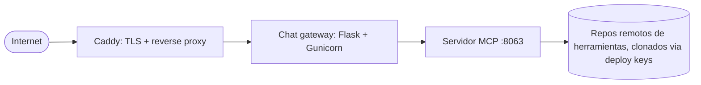

# Despliegue

La instancia pública en `mcp.okfn.org` corre desde el repo
`mcp-deployment`: un pequeño stack de Docker Compose enviado a un VPS
con rsync. Sin Kubernetes, sin ataduras a una nube.

!!! note "Repo privado"
    `mcp-deployment` es nuestra propia infraestructura, así que el repo
    no está disponible públicamente. Si necesitas ayuda para desplegar
    tu propia instancia, contáctanos.

## El stack



- **caddy**: termina TLS y reenvía el tráfico al gateway.
- **gateway**: la UI de chat, necesita `AI_API_KEY` en un archivo `.env`.
- **server**: el servidor MCP, instala los repos de plugins listados en
  `server/tool_sources.yaml` al momento del build.

## Comandos del día a día

```bash
make help          # list all targets
make deploy        # rsync code to the VPS + docker compose up --build
make logs          # last 100 lines (SERVICE=server to filter)
make logs-follow   # tail in real time
```

!!! note "Borrador"
    Esta página es un resumen. Está planificado un runbook más completo
    (configuración inicial del VPS, secretos, actualización de plugins
    en producción); por ahora la referencia es el propio repo
    `mcp-deployment`.
