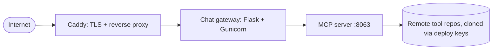

# Deployment

The public instance at `mcp.okfn.org` runs from the `mcp-deployment`
repo: a small Docker Compose stack pushed to a VPS with rsync. No
Kubernetes, no cloud lock-in.

## The stack



- **caddy**: terminates TLS and forwards traffic to the gateway.
- **gateway**: the chat UI, needs `AI_API_KEY` in a `.env` file.
- **server**: the MCP server, installs the plugin repos listed in
  `server/tool_sources.yaml` at build time.

## Day-to-day commands

```bash
make help          # list all targets
make deploy        # rsync code to the VPS + docker compose up --build
make logs          # last 100 lines (SERVICE=server to filter)
make logs-follow   # tail in real time
```

!!! note "Stub"
    This page is a summary. A fuller runbook (first-time VPS setup,
    secrets, updating plugins in production) is planned; for now the
    `mcp-deployment` repo itself is the reference.
