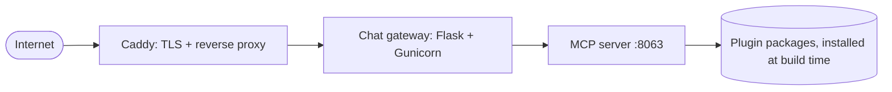

# Deployment

The public instance at `mcp.okfn.org` runs from the `mcp-deployment`
repo: a small Docker Compose stack pushed to a VPS with rsync. No
Kubernetes, no cloud lock-in.

!!! note "Private repo"
    `mcp-deployment` is our own infrastructure, so the repo is not
    publicly available. If you need help deploying your own instance,
    contact us.

## The stack

```mermaid
flowchart LR
    internet([Internet]) --> caddy[Caddy: TLS + reverse proxy]
    caddy --> gateway[Chat gateway: Flask + Gunicorn]
    gateway --> server[MCP server :8063]
    server --> tools[(Plugin packages, installed at build time)]
```

- **caddy**: terminates TLS and forwards traffic to the gateway.
- **gateway**: the chat UI, needs `AI_API_KEY` in a `.env` file.
- **server**: the MCP server; its image pip-installs the plugin
  packages at build time.

!!! note "Stub"
    This page is a summary. A fuller runbook (first-time VPS setup,
    secrets, updating plugins in production) is planned; in the
    meantime, contact us if you need those details.
