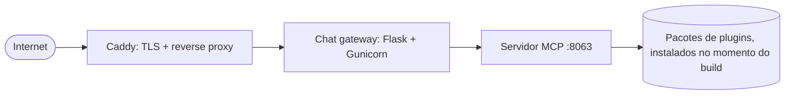

# Implantação

A instância pública em `mcp.okfn.org` roda a partir do repo
`mcp-deployment`: uma pequena stack de Docker Compose enviada a um VPS
com rsync. Sem Kubernetes, sem lock-in de nuvem.

!!! note "Repo privado"
    `mcp-deployment` é a nossa própria infraestrutura, então o repo não
    está disponível publicamente. Se você precisar de ajuda para
    implantar sua própria instância, entre em contato conosco.

## A stack

- **caddy**: termina o TLS e encaminha o tráfego para o gateway.
- **gateway**: a UI de chat, precisa de `AI_API_KEY` em um arquivo `.env`.
- **server**: o servidor MCP; sua imagem instala com pip os pacotes
  dos plugins no momento do build.

!!! note "Rascunho"
    Esta página é um resumo. Um runbook mais completo (configuração
    inicial do VPS, segredos, atualização de plugins em produção) está
    planejado; enquanto isso, entre em contato conosco se você precisar
    desses detalhes.
