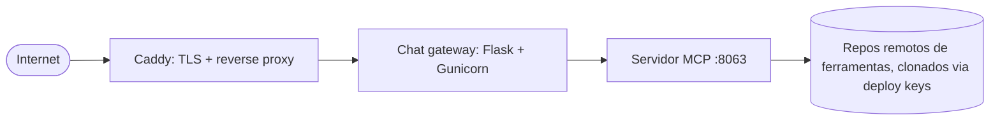

# Implantação

A instância pública em `mcp.okfn.org` roda a partir do repo
`mcp-deployment`: uma pequena stack de Docker Compose enviada a um VPS
com rsync. Sem Kubernetes, sem lock-in de nuvem.

## A stack



- **caddy**: termina o TLS e encaminha o tráfego para o gateway.
- **gateway**: a UI de chat, precisa de `AI_API_KEY` em um arquivo `.env`.
- **server**: o servidor MCP, instala os repos de plugins listados em
  `server/tool_sources.yaml` no momento do build.

## Comandos do dia a dia

```bash
make help          # list all targets
make deploy        # rsync code to the VPS + docker compose up --build
make logs          # last 100 lines (SERVICE=server to filter)
make logs-follow   # tail in real time
```

!!! note "Rascunho"
    Esta página é um resumo. Um runbook mais completo (configuração
    inicial do VPS, segredos, atualização de plugins em produção) está
    planejado; por enquanto a referência é o próprio repo
    `mcp-deployment`.
