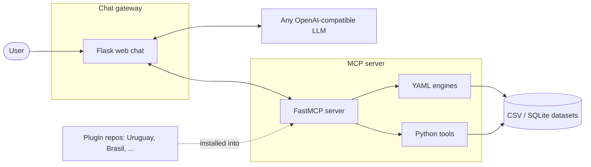

# Architecture

Three moving parts, one contract between them.

## The flow of a question

1. The user types a question in the **chat gateway**.
2. The gateway sends the conversation to an LLM, together with the list
   of tools it fetched from the **MCP server**.
3. The LLM decides which tool to call and with which parameters.
4. The MCP server runs the tool against the real dataset and returns
   two things: a text answer for the LLM, and a structured payload
   (sources, tables, charts) for the UI.
5. The gateway streams the final answer and renders the structured
   parts: source links, tables, Chart.js charts.

## The contract

Every tool returns both a human-readable text (for the LLM) and a
`structuredContent` payload (for the UI) that must include the data
sources. Crucially, only the text is sent to the model; the tables and
charts in `structuredContent` are rendered straight to the interface,
**never passing through the AI**. They are produced by human-written
tool code, so they show exactly what was computed from the data. This
contract is what keeps answers traceable, and it is described in detail
in [tool results](../plugins/tool-results.md).

## Transports

The MCP server speaks two transports:

- **stdio**: for local use, e.g. plugging it into Claude Desktop.
- **HTTP**: for real deployments, where the gateway (or any client)
  connects over the network.
