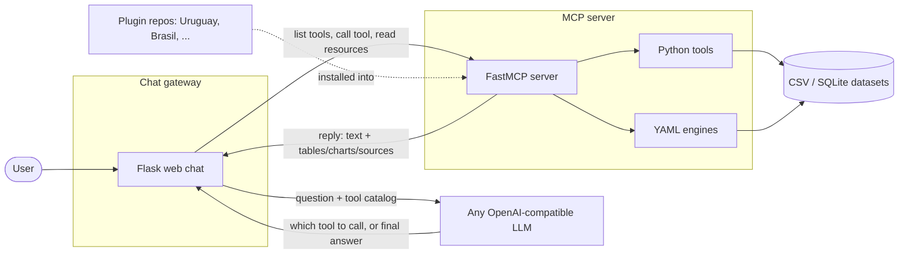

# Architecture

Three moving parts, one contract between them.

The **gateway is the only initiator**: it calls both the LLM and the MCP
server and waits for each reply. The LLM and the MCP server never talk to
each other, and the MCP server cannot interrupt: it only ever speaks when
spoken to.

That is about *timing*. It is not about *content*. When the gateway calls
a tool, it asks only for that tool to run, but the tool decides what
comes back, and anything it puts in `structuredContent` is rendered
straight to the screen. A tool can return a table, a chart, or a `force`
message, and the interface will display it without the AI or the gateway
approving it first. **Tool code has direct write access to the chat.**
That is deliberate: it is what makes the numbers on screen come from
human-written code instead of from the model.

Both links are request/response over HTTP, not bidirectional push. Each
pair of arrows above is one call the gateway makes and the answer it gets
back.

## The flow of a question

1. The user types a question in the **chat gateway**.
2. The gateway asks the **MCP server** for its tool catalog (`tools/list`).
   This happens on the gateway's own initiative, before the AI is
   involved.
3. The gateway sends the conversation plus that tool catalog to the LLM.
4. The LLM does not call anything itself. It replies with the **name** of
   a tool and the parameters to use, or with a final text answer.
5. If a tool was named, the gateway calls it on the MCP server
   (`tools/call`). The server runs the tool against the real dataset and
   **returns** two things in its reply: a text answer for the LLM, and a
   structured payload (sources, tables, charts) for the UI.
6. The gateway feeds the text back to the LLM (which may then answer or
   call another tool), and renders the structured parts itself: source
   links, tables, Chart.js charts.

So the MCP server never opens a connection to the chat on its own. But
within the reply to a call the gateway made, the tool decides what the
user sees, and the gateway renders it as-is. A tool can even return a
`force` message: text shown directly to the user as its own message,
which is never added to the conversation the LLM reads. In that case the
tool is talking to the human over the model's head, by design.

## The contract

Every tool returns both a human-readable text (for the LLM) and a
`structuredContent` payload (for the UI) that must include the data
sources. Crucially, only the text is sent to the model; the tables and
charts in `structuredContent` are rendered straight to the interface,
**never passing through the AI**. They are produced by human-written
tool code, so they show exactly what was computed from the data. This
contract is what keeps answers traceable, and it is described in detail
in [tool results](../plugins/tool-results.md).

## Transports

The MCP server speaks two transports:

- **stdio**: for local use, e.g. plugging it into Claude Desktop.
- **HTTP**: for real deployments, where the gateway (or any client)
  connects over the network.
